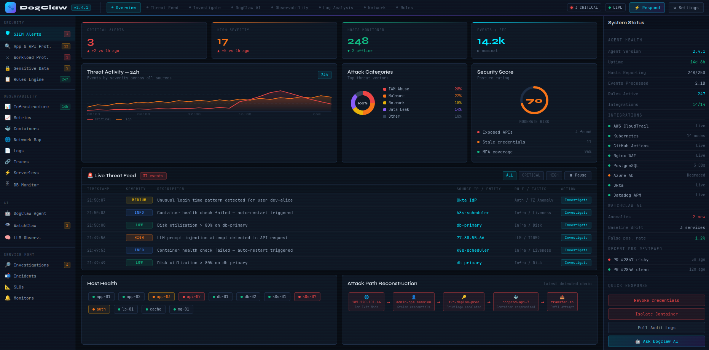

# 🐾 DogClaw — Unified Threat Detection & Observability Platform

> **A single-machine, browser-based threat detection system that unifies observability and security data with AI-powered investigation and automated response.**

---


## What is DogClaw?

DogClaw is an open, self-hosted Security Information and Event Management (SIEM) platform combined with full-stack observability. It ingests metrics, logs, traces, and security events from your entire infrastructure — cloud, containers, serverless, databases, and IoT — and surfaces threats in real time through a unified browser interface.

The platform is built around four pillars:

1. **Observability** — Infrastructure health, container monitoring, APM traces, database query metrics, network flows, serverless performance, and error tracking.
2. **Security** — Real-time threat detection, WAF/IDS correlation, workload protection, sensitive data scanning, and SIEM signal triage.
3. **AI** — The DogClaw AI Agent automates investigation, PR security review, attack path reconstruction, anomaly detection (WatchClaw), and LLM observability.
4. **Response** — One-click incident response actions, automated playbooks, rule-based alerting, and integration with PagerDuty, Slack, and ticketing systems.

---

## Key Features

### Security
- Real-time SIEM alert feed with MITRE ATT&CK tagging
- App & API protection (WAF correlation, OWASP Top 10 detection)
- Workload protection (container process baseline, file integrity)
- Sensitive data scanner (PII, secrets, API keys in logs/telemetry)
- Rules engine supporting custom rules and SIGMA import
- Attack path reconstruction from correlated observability data

### Observability
- Infrastructure metrics (CPU, memory, disk, network) across 250+ hosts
- Container & Kubernetes monitoring (pod health, image CVEs, resource limits)
- APM traces with service dependency maps
- Database query performance monitoring (PostgreSQL, MySQL, Redis)
- Serverless cold start and error tracking (AWS Lambda, GCP Functions)
- Network performance monitoring with geo-anomaly detection
- Data streams monitoring (Kafka, Kinesis)
- Continuous profiling and flamegraph comparison

### AI Intelligence
- **DogClaw AI Agent** — Natural language investigation, automated triage, PR code security review
- **WatchClaw** — Unsupervised anomaly detection across all telemetry streams
- **LLM Observability** — Trace, monitor, and secure LLM-based application calls

### Service Management
- Case management with investigation timelines
- SLO tracking and error budget burn alerts
- Monitor & alert configuration with multi-condition rules
- Incident management with runbook integration

---

## Architecture Overview

```
┌─────────────────────────────────────────────────────────────┐
│                     Browser UI (dogclaw.html)               │
│         Observability │ Security │ AI Agent │ Response      │
└─────────────────────────────┬───────────────────────────────┘
                              │ WebSocket / REST
┌─────────────────────────────▼───────────────────────────────┐
│                   DogClaw Backend (server.py)               │
│  FastAPI │ WebSocket Hub │ Rules Engine │ AI Orchestrator   │
└──────┬──────────┬──────────┬──────────┬──────────┬──────────┘
       │          │          │          │          │
  ┌────▼──┐  ┌───▼───┐  ┌───▼───┐  ┌───▼───┐  ┌──▼────┐
  │Metrics│  │  Log  │  │Traces │  │Events │  │  AI   │
  │Ingest │  │Ingest │  │Ingest │  │Ingest │  │Engine │
  └───────┘  └───────┘  └───────┘  └───────┘  └───────┘
       │          │          │          │
  ┌────▼──────────▼──────────▼──────────▼──────────────┐
  │              TimescaleDB / SQLite                   │
  │         (metrics, logs, events, cases)              │
  └─────────────────────────────────────────────────────┘
```

---

## Quick Start

See [`QUICKSTART.md`](QUICKSTART.md) for full step-by-step setup including agent installation and integration configuration.

```bash
# Clone and install
git clone https://github.com/david-spies/dogclaw
cd dogclaw
pip install -r requirements.txt

# Start the backend
python server.py

# Open the UI
open http://localhost:8000
```

---

## Documentation

| File | Description |
|------|-------------|
| [`QUICKSTART.md`](QUICKSTART.md) | Step-by-step installation and integration setup |
| [`DEVELOPMENT.md`](DEVELOPMENT.md) | Architecture deep-dive, contribution guide, extending the platform |
| [`TECHSTACK.md`](TECHSTACK.md) | Full technology stack reference |
| [`requirements.txt`](requirements.txt) | Python dependencies |

---

## Supported Integrations

| Category | Integrations |
|----------|-------------|
| Cloud | AWS (CloudTrail, GuardDuty, S3, Lambda), GCP (Cloud Logging, Pub/Sub), Azure (Monitor, AD) |
| Containers | Kubernetes, Docker, containerd, ECS, EKS, GKE |
| Identity | Okta, Auth0, Azure AD, AWS IAM |
| APM | OpenTelemetry, Jaeger, Zipkin, Datadog Agent |
| Databases | PostgreSQL, MySQL, MongoDB, Redis, Elasticsearch |
| Messaging | Kafka, RabbitMQ, AWS Kinesis, AWS SQS |
| Code | GitHub, GitLab, Bitbucket (PR security scanning) |
| Alerting | PagerDuty, Slack, OpsGenie, email (SMTP) |
| Security | Snort, Suricata, Zeek, OSSEC, CrowdStrike Falcon |

---

## License

MIT - use it, fork it, teach with it.
